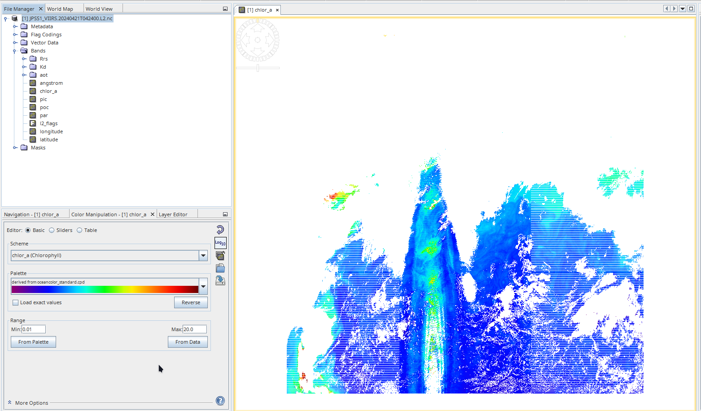
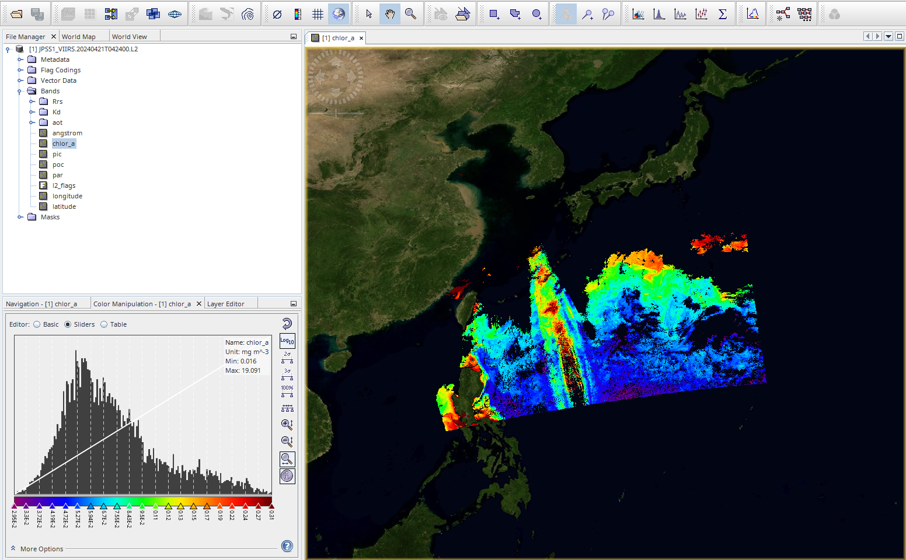
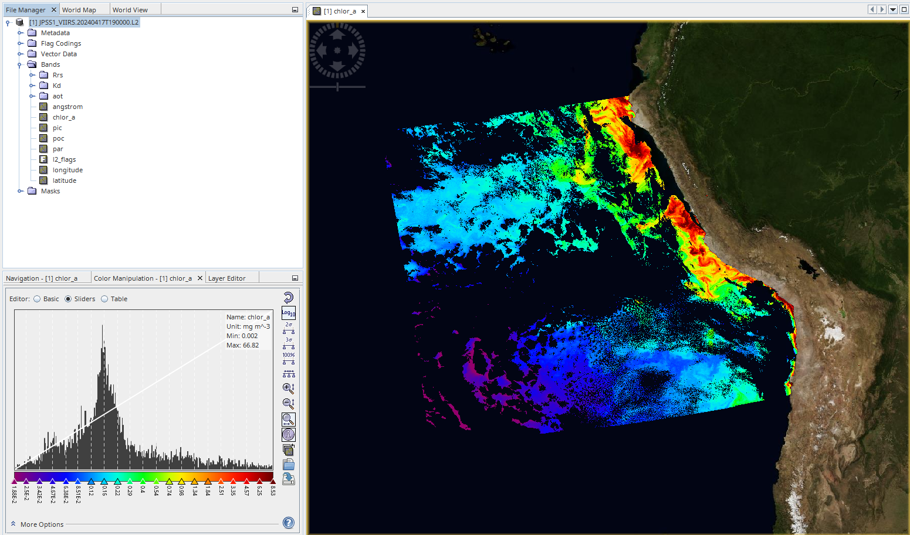

# SimpleSeaDAS

Библиотека интерфейсов для взаимодействия с инструментами SeaDAS, OCSSW, OceanDATA и автоматизации процессов обработки.

## Возможности

- Скачивание космических снимков с сайта [OceanData](https://oceandata.sci.gsfc.nasa.gov/directdataaccess/)
- Обработка космических снимков с помощью [OCSSW SeaDAS](https://oceandata.sci.gsfc.nasa.gov/ocssw/)
- Повышение уровня обработки посредством ПО [Graph processing tool SeaDAS](https://seadas.gsfc.nasa.gov/)

## Содержание

- [OceanDATA](#OceanDATA)
- [OCSSW](#OCSSW)
- [GPT](#GPT)
- [VIIRS](#VIIRS)
- [Примеры](#пример-использования-всех-модулей)

## OceanDATA

### Подготовка

Для работы модуля необходим токен с сайта [OceanData](https://oceandata.sci.gsfc.nasa.gov/).

Получить его можно зарегистрировавшись на сайте [EarthData](https://urs.earthdata.nasa.gov/users/new) и авторизовавшись на [OceanDataAppkey](https://oceandata.sci.gsfc.nasa.gov/appkey/)

### Примеры использования

#### Для начала необходимо инициализировать объект OceanData с ключом полученным [ранее](#подготовка)

```python

from simpleSeaDAS.OceanData import OceanData
appkey = "your_appkey"
OD = OceanData(appkey)
```

#### Поиск

Поиск использует [API OceanData](https://oceandata.sci.gsfc.nasa.gov/api/file_search/)

Для поска нужно определить ряд параметров:

- sensor - инструмент, данные которого буду искаться. Список доступных инструментов можно получить из справочника `OceanData.const.SENSORS`
- data_type - тип данных соответствующего инструмента. Список доступных типов данных можно получить из справочника `OceanData.const.DATA_TYPES`
- start_date - объект datetime с датой и временем с какого момента времени искать
- end_date - объект datetime с датой и временем до невключительно какого момента времени искать

Пример:

```python
import datetime

sensor = 'NOAA20-VIIRS'
data_type = 'JPSS1-VIIRS Time-based Level-1A'
start_date = datetime.datetime(2024, 4, 12, 23, 30, 0)
end_date = datetime.datetime(2024, 4, 12, 23, 54, 59)
config = {
    'sensor': sensor,
    'data_type': data_type,
    'start_date': start_date,
    'end_date': end_date
}
found = OD.find(config)
print(found)
```

Вывод:

```
['JPSS1_VIIRS.20240412T233000.L1A.nc', 'JPSS1_VIIRS.20240412T233600.L1A.nc', 'JPSS1_VIIRS.20240412T234200.L1A.nc', 'JPSS1_VIIRS.20240412T234800.L1A.nc', 'JPSS1_VIIRS.20240412T235400.L1A.nc']
```

#### Скачивание

Скачивание использует `https://oceandata.sci.gsfc.nasa.gov/getfile/filename`, где `filename` это имя файла для скачивания. Получить список файлов для скачивания можно посредством [поиска](#поиск)

`OceanData.download(filename, folder=CWD) -> Path`

Пример:

```python
print(OD.download("JPSS1_VIIRS.20240421T042400.L1A.nc", "/home/twistru/downloads/")
```

Вывод:

```
/home/twistru/downloads/JPSS1_VIIRS.20240421T042400.L1A.nc
```

`OceanData.download_severals([filename1, filename2], folder=CWD) -> List[Path]`

Пример:

```python
print(OD.download_severals(["JPSS1_VIIRS.20240421T042400.L1A.nc", "JPSS1_VIIRS.20240421T042400.GEO.nc"], "/home/twistru/downloads/"))
```

Вывод:

```
['/home/twistru/downloads/JPSS1_VIIRS.20240421T042400.L1A.nc', '/home/twistru/downloads/JPSS1_VIIRS.20240421T042400.GEO.nc']
```

## OCSSW

Данный модуль реализует те же функции, что и оригинальный ocssw, но в виде python интерфейса

Прочитать про эти функции можно в документации [OCSSW](https://seadas.gsfc.nasa.gov/help-9.0.0/processors/ProcessOverview.html)

### Подготовка

Для работы данного модуля нужен установленный пакет программ OCSSW(OceanColor Science Software). Установить его можно разными путями, все они описаны [тут](https://seadas.gsfc.nasa.gov/downloads/#install-with-gui)

#### Для начала необходимо инициализировать объект OCSSW с полным путем до корневой папки, где установлен OCSSW

```python
from simpleSeaDAS import OCSSW
ocssw_path = "/path/to/your/ocssw"
ocssw = OCSSW(ocssw_path)
```

### Примеры использования

#### l2gen

Прочитать про функцию и её параметры можно [тут](https://seadas.gsfc.nasa.gov/help-9.0.0/processors/ProcessL2gen.html#COMMAND_LINE_HELP). Наша функция принимает все те же параметры что и исходная

Пример на основе двух файлов скачанных из примера скачивания нескольких файлов OceanData

```python
ocssw.l2gen(
    {
        'ifile': "/home/twistru/downloads/JPSS1_VIIRS.20240421T042400.L1A.nc",
        'geofile': "/home/twistru/downloads/JPSS1_VIIRS.20240421T042400.GEO.nc",
        'ofile': f"/home/twistru/downloads/l2gen/JPSS1_VIIRS.20240421T042400.L2.nc",
    }
)
```

SeaDAS:


## GPT

Данный модуль реализует те же функции, что и оригинальный Graph Processint Tool, но в виде python интерфейса

Прочитать про эти функции можно в документации [GPT](https://seadas.gsfc.nasa.gov/help-9.0.0/GptCookbook/gptCookbook.html)

### Подготовка

Чтобы воспользоваться GPT нужен установленный пакет SeaDAS и путь до исполняемого bash файла gpt.

#### Для начала необходимо инициализировать объект GPT с полным путем до исполняемого файла gpt

```python
from simpleSeaDAS import GPT

path_to_gpt = "/path/to/your/SeaDAS/bin/gpt"
gpt = GPT(path_to_gpt)
```

### Примеры использования

#### reproject

Прочитать про данную функцию и её параметры можно [тут](https://seadas.gsfc.nasa.gov/help-9.0.0/gpf/org_esa_snap_core_gpf_common_reproject_ReprojectionOp.html)

```python
gpt.reproject('/home/twistru/downloads/l2gen/JPSS1_VIIRS.20240421T042400.L2.nc',
              '/home/twistru/downloads/reproject/JPSS1_VIIRS.20240421T042400.L2.dim',
              {'pixelSizeX': 0.01, 'pixelSizeY': 0.01})
```

SeaDAS:


## VIIRS

Этот модуль представлен как пример более понятного интерфейса для работы с конкретным инструментом и его особенностями.

В состав входит функция `l2gen`, которая имеет более строгую сигнатуру соответствующую требованиям обработки инструмента VIIRS

Пример:

```python
path_to_ocssw = "path/to/yout/ocssw"
ocssw = OCSSW(path_to_ocssw)
VIIRS.generateL2(
    ocssw,
    'JPSS1_VIIRS.20240414T145400.L1A.nc',
    'JPSS1_VIIRS.20240414T145400.GEO.nc',
    'JPSS1_VIIRS.20240414T145400.L2.nc'
  )
```

## Пример использования всех модулей

```python
import datetime
from simpleSeaDAS import GPT, OCSSW, VIIRS
from simpleSeaDAS.OceanData import OceanData


appkey = 'your_appkey'
path_to_ocssw = "path/to/your/ocssw"
path_to_gpt = "path/to/your/SeaDAS/bin/gpt"
OD = OceanData(appkey)
ocssw = OCSSW(path_to_ocssw)
gpt = GPT(path_to_gpt)
start_date = datetime.datetime(2024, 4, 17, 19, 0, 0)
end_date = datetime.datetime(2024, 4, 17, 19, 0, 59)
sensor = 'NOAA20-VIIRS'
data_type = 'JPSS1-VIIRS Time-based Level-1A'
search_config = {
    'sensor': sensor,
    'data_type': data_type,
    'start_date': start_date,
    'end_date': end_date
}
search = OD.find(search_config)[0]
base = '.'.join(search.split('.')[:2])
downloaded = OD.download_severals([f"{base}.L1A.nc",
                                   f"{base}.GEO.nc"], "/home/twistru/downloads/")

VIIRS.generateL2(
    ocssw,
    downloaded[0],
    downloaded[1],
    f'/home/twistru/downloads/l2gen/{base}.L2.nc')

gpt.reproject(f'/home/twistru/downloads/l2gen/{base}.L2.nc',
              f'/home/twistru/downloads/reproject/{base}.L2.dim',
              {'pixelSizeX': 0.01, 'pixelSizeY': 0.01})

```

SeaDAS:

